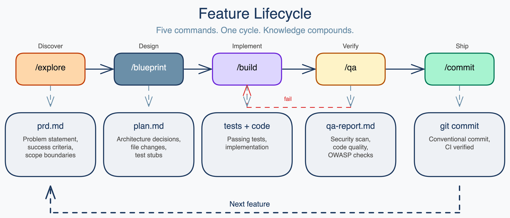
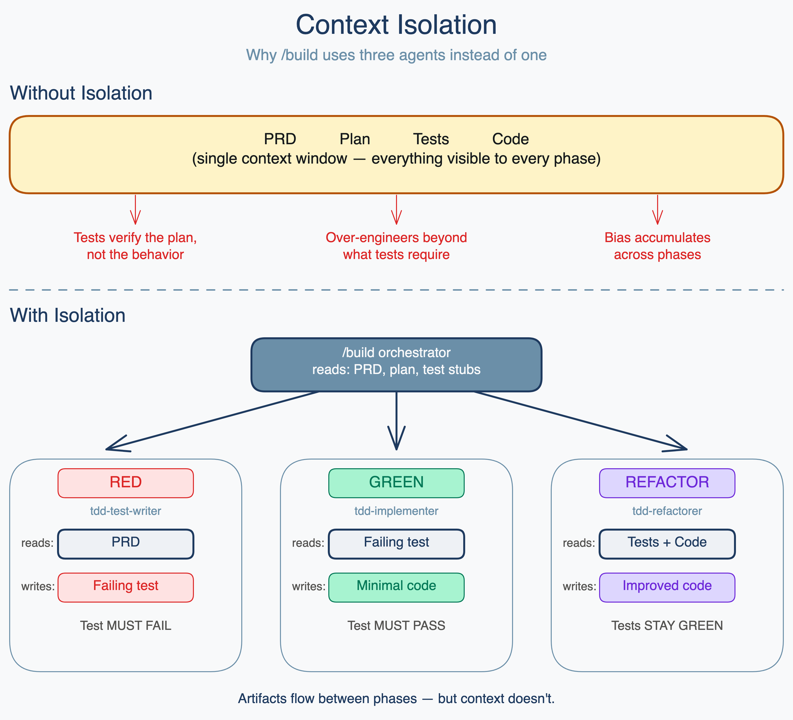
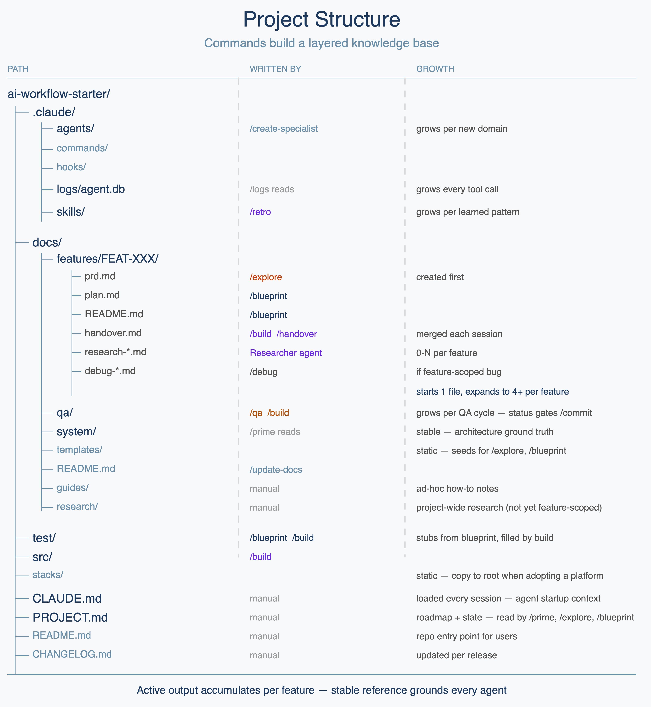
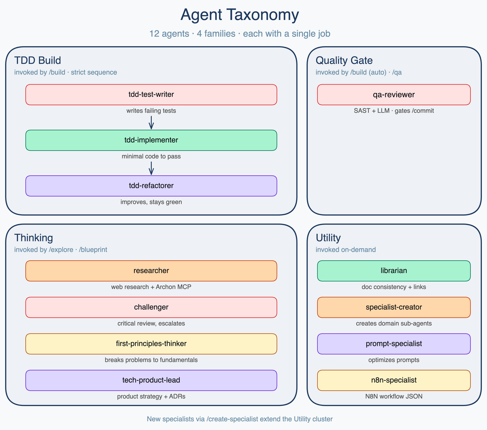
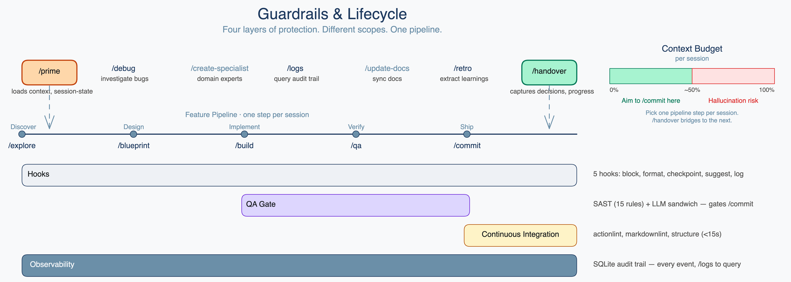

[](https://github.com/jackrich78/project-starter/actions/workflows/validate.yml)
[](LICENSE)

# Project Starter

A project template for AI-assisted software development using Claude Code.

> **Before you start:** This is a template you copy into your project, not a package you install. It requires [Claude Code](https://claude.ai/code) (Anthropic's AI coding CLI) to run. It is stack-agnostic — it works with any language or framework. It is not an npm package, framework, or standalone CLI.

---

AI-assisted development is fast but chaotic. Context gets lost between sessions, decisions aren't recorded, and each session starts from scratch. This template gives Claude Code a structured harness: commands orchestrate specialized agents, every decision lands in a knowledge base, and each session picks up exactly where the last one left off.

The result is development that compounds. The longer you use it, the better the context — and the better the output.

---

## What You Get

- A command (`/explore`) that interviews you about the problem, researches the space, and produces a structured spec — so you never start from a blank page.
- A TDD pipeline (`/build`) that runs three context-isolated agents — test writer, implementer, refactorer — so each phase is unbiased by the others.
- A QA gate that runs 15 SAST rules and an OWASP checklist before any commit is allowed through.
- A session continuity system: `/handover` captures what you did and what's next in under 1,500 tokens; `/prime` loads it at the start of the next session.
- 12 agents with defined responsibilities — researchers, challengers, TDD specialists, and quality reviewers — each scoped to a single job.
- 16 skills that accumulate across features via `/retro`, so patterns you discover in one feature are available in the next.

---

## Prerequisites

| Requirement | Why | Install |
|-------------|-----|---------|
| Claude Code | The AI CLI this template runs inside | `npm install -g @anthropic-ai/claude-code` |
| Node.js ≥ 18 | Runs the test suite | [nodejs.org](https://nodejs.org) |
| Git | Version control | [git-scm.com](https://git-scm.com) |
| gh CLI | Required for `/commit` CI verification | `brew install gh` |

---

## Quick Start

```bash
# 1. Use this template on GitHub (click "Use this template"), or clone directly
git clone https://github.com/YOUR_USERNAME/project-starter.git my-project
cd my-project

# 2. Install dependencies
npm install

# 3. Reinitialize git (optional — start with a clean history)
rm -rf .git && git init && git add . && git commit -m "chore: init from project-starter"

# 4. Open the project in Claude Code
claude .

# 5. Load context and begin
/prime build
/explore your first feature idea
```

**Verify setup:** `npm test` should pass before you start. See [docs/guides/getting-started.md](docs/guides/getting-started.md) for the full setup path, including stacks, adding the template to an existing project, and troubleshooting.

---

## See It In Action

Here is what a typical feature session looks like, from idea to commit:

```
$ /explore add a health check endpoint
  → asks 3 clarifying questions (scope, auth, response format)
  → researches existing patterns in the codebase
  → creates docs/features/FEAT-001_health-check/prd.md

$ /blueprint FEAT-001
  → reads the actual codebase to validate assumptions
  → drafts implementation steps with test stubs
  → runs Challenger review to catch gaps before code is written

$ /build FEAT-001
  → RED:     tdd-test-writer writes failing tests (sees only the PRD)
  → GREEN:   tdd-implementer writes minimal code to pass (sees only the tests)
  → REFACTOR: tdd-refactorer cleans up (sees tests + implementation)
  → QA:      qa-reviewer runs SAST + OWASP checklist → APPROVED

$ /commit
  → QA gate passes
  → commit formatted to Conventional Commits standard
  → CI pipeline runs and passes
```

---

## How It Works — Feature Lifecycle



Every feature moves through five commands: `/explore` produces a spec, `/blueprint` produces a verified plan, `/build` produces tested code, `/qa` reviews it with SAST and OWASP analysis, and `/commit` closes the loop with CI verification. Each command produces artifacts that the next command reads — so nothing is lost between steps. The feature folder (`docs/features/FEAT-XXX/`) accumulates the PRD, plan, handover, and QA report as durable context that survives session boundaries.

---

## Context Isolation



The three TDD agents in `/build` each run in a fresh 200k-token context window. The test writer sees only the PRD — not the implementation plan. The implementer sees only the failing tests — not the PRD or any prior discussion. The refactorer sees the tests and implementation, but not what the other agents decided. These walls are intentional: an implementer that reads the plan writes code that matches the plan, not code that passes the tests. Isolation enforces the discipline.

---

## Project Structure



| Path | What lands here |
|------|----------------|
| `docs/features/FEAT-XXX/` | PRD, plan, handover, and QA report per feature |
| `docs/qa/` | QA review reports from `/qa` and `/build` |
| `.claude/agents/` | Agent definitions (12 built-in + any you create with `/create-specialist`) |
| `.claude/skills/` | Skills accumulated via `/retro` |
| `.claude/hooks/` | Runtime guardrails (pre/post tool use, session start, compact, stop) |
| `.claude/logs/` | SQLite audit trail of every tool call |
| `stacks/` | Deployment scaffolding — copy to root when using a stack, then delete |
| `test/` | Your project tests (unit/, integration/, e2e/) |

---

## Commands

### Discovery

| Command | What it does |
|---------|-------------|
| `/explore [topic]` | Interviews you about the problem, researches the space, and produces a structured feature spec (PRD) with success criteria and scope. |
| `/blueprint FEAT-XXX` | Translates the PRD into a verified technical plan: reads the actual codebase, validates assumptions, drafts implementation steps, and runs a Challenger review to catch gaps. |

### Build

| Command | What it does |
|---------|-------------|
| `/build FEAT-XXX` | Implements the feature using TDD with three isolated subagents: test writer, implementer, refactorer. QA reviewer runs automatically after. |
| `/debug [issue]` | 6-phase investigation: classify, find root cause, implement fix, write regression test, verify, document. Coordinates with QA and Challenger agents. |

### Quality

| Command | What it does |
|---------|-------------|
| `/qa [target]` | Two-layer review on any file, directory, or feature: Semgrep SAST (15 rules), then LLM analysis against the OWASP checklist. Outputs APPROVED / NEEDS_FIXES / BLOCKED. |
| `/commit [message]` | Checks the QA gate, stages changes, formats the commit message to Conventional Commits standard, pushes, and waits for CI to pass. |

### Session

| Command | What it does |
|---------|-------------|
| `/prime [mode] [FEAT-XXX]` | Loads context for your session: architecture docs, feature files, and handover. Modes: `think`, `build`, `review`. |
| `/handover [FEAT-ID]` | Captures what you did, what decisions were made, and what's next — in a token-budgeted summary under 1,500 tokens. |
| `/retro [FEAT-XXX]` | Reviews completed work, extracts recurring patterns, and crystallizes them into reusable skills. |
| `/logs [filter]` | Queries the SQLite audit trail. Filters: `recent`, `tools`, `sessions`, `count`. |
| `/create-specialist [library]` | Generates a domain-expert agent for a specific library or API. Saved to `.claude/agents/` for future use. |
| `/update-docs [scope]` | Validates cross-references, updates the documentation index, and flags broken links or stale file references. |

> Full reference with "when to run" context: [docs/guides/commands-reference.md](docs/guides/commands-reference.md)

---

## Agents



12 agents ship with the harness, organized into four groups:

| Group | Agents | What the group does |
|-------|--------|---------------------|
| TDD Build | tdd-test-writer, tdd-implementer, tdd-refactorer | Run the RED-GREEN-REFACTOR cycle in isolated context windows |
| Quality Gate | qa-reviewer | Static analysis + OWASP review with a clean context every time |
| Thinking | researcher, challenger, first-principles-thinker, product-engineering-lead | Research, critique, reason, and plan before code is written |
| Utility | specialist-creator, prompt-specialist, n8n-specialist, librarian | Extend the harness, generate prompts, build integrations, maintain docs |

Full agent definitions and tool access: [.claude/agents/README.md](.claude/agents/README.md)

---

## Skills

Skills are modular decision guides bundled with context, templates, and references. Commands import them automatically when relevant — you don't invoke most skills directly. After each feature, `/retro` reviews what you learned and crystallizes recurring patterns into new skills stored in `.claude/skills/`. The harness gets more capable with every feature you ship.

16 skills ship with the harness, covering development workflow, content creation, technical integration, and utilities.

> Full list with descriptions: [docs/guides/skills-reference.md](docs/guides/skills-reference.md)

---

## Guardrails and Lifecycle



Four layers of quality enforcement run throughout the development lifecycle:

**Runtime hooks (5 hooks, 30 blocked patterns)**
Pre- and post-tool hooks intercept every Bash command and file operation. Destructive patterns (force pushes, recursive deletes, credential writes) are blocked before they execute. Every hook event is logged to SQLite.

**QA gate (15 SAST rules, OWASP checklist)**
`/qa` and `/build` both run Semgrep static analysis followed by an LLM pass against the OWASP Top 10. Verdicts: `APPROVED` (ready to commit), `NEEDS_FIXES` (blocking issues found), `BLOCKED` (escalate to human). `/commit` will not proceed without APPROVED status.

**CI pipeline**
GitHub Actions validation runs in under 15 seconds on push. Checks scaffold structure, validates YAML syntax, and confirms the test suite passes.

**Observability and response**
Every tool call is logged to `.claude/logs/agent.db`. Use `/logs` to query the audit trail and `/debug` for systematic investigation when something goes wrong.

Supporting lifecycle commands:

| Command | When to use |
|---------|-------------|
| `/prime` | Start of every session — loads context and handover |
| `/handover` | Before ending a session — captures state for next time |
| `/retro` | After a feature ships — extracts patterns into skills |
| `/debug` | When something breaks — systematic root cause investigation |
| `/logs` | When you want to audit what Claude actually did |
| `/update-docs` | After documentation changes — validates cross-references |
| `/create-specialist` | Before working with a new library — create a domain expert once |

See [docs/system/observability.md](docs/system/observability.md) for hook architecture and query examples.

---

## Knowledge Compounding

The harness is designed to get smarter over time through three accumulation layers:

**Feature docs** — Each feature produces a folder at `docs/features/FEAT-XXX/` containing the PRD, implementation plan, session handover, and QA report. Nothing is thrown away between sessions.

**Skills** — Cross-cutting patterns that appear across features get captured in `.claude/skills/` via `/retro`. A debugging approach that worked in FEAT-003 is available as a skill when you hit a similar problem in FEAT-012.

**Session continuity** — `/handover` produces a token-budgeted summary (under 1,500 tokens) of what was done, what decisions were made, and what's next. `/prime` loads it automatically at session start. Each merge prunes what's no longer relevant, so the context stays sharp rather than growing stale.

See [docs/system/observability.md](docs/system/observability.md) for the dual-system session recovery design.

---

## Extending

Two extension points, both optional, both fail-open:

**Stacks** — Pre-configured deployment scaffolding for specific targets. The `stacks/` directory contains a Cloudflare Workers example. To apply a stack: copy its contents to the project root, then delete `stacks/`. See [stacks/README.md](stacks/README.md) for the merge pattern and how to add your own.

**Specialists** — `/create-specialist [library]` generates a domain-expert agent for any library or API (Supabase, Stripe, OpenAI, etc.). The agent is saved to `.claude/agents/` and invoked as a subordinate by other commands when that library is relevant. Create it once, use it across every feature that touches that library.

---

## Documentation

- [Getting Started](docs/guides/getting-started.md)
- [Architecture](docs/system/architecture.md)
- [Commands Reference](docs/guides/commands-reference.md)
- [Skills Reference](docs/guides/skills-reference.md)
- [Observability](docs/system/observability.md)
- [CI/CD Workflow](docs/system/cicd-workflow.md)

---

## Contributing

Fork the repo, create a feature branch, and use the harness itself to build your contribution: `/explore` to define the feature, `/blueprint` for the plan, then implement and open a PR. Use [Conventional Commits](https://www.conventionalcommits.org/) format for all commit messages. Open issues for bugs or feature requests.

---

## License

MIT. See [LICENSE](LICENSE).

---

## Acknowledgments

Built on patterns and practices from:
- [Anthropic's Claude Code best practices](https://www.anthropic.com/engineering/claude-code-best-practices)
- [Context engineering for AI agents](https://www.anthropic.com/engineering/effective-context-engineering-for-ai-agents) (Anthropic)
- [Conventional Commits](https://www.conventionalcommits.org/)
- Inspired by [coleam00's context engineering foundation](https://github.com/coleam00/context-engineering-intro)
